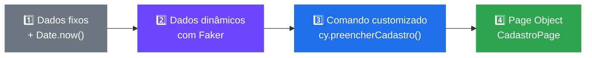
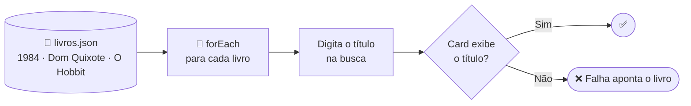
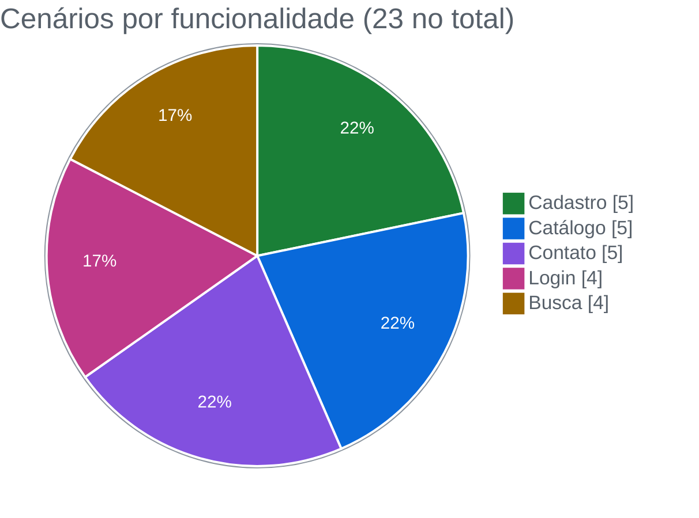
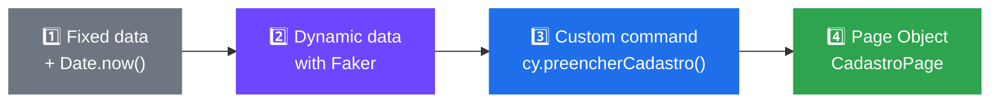
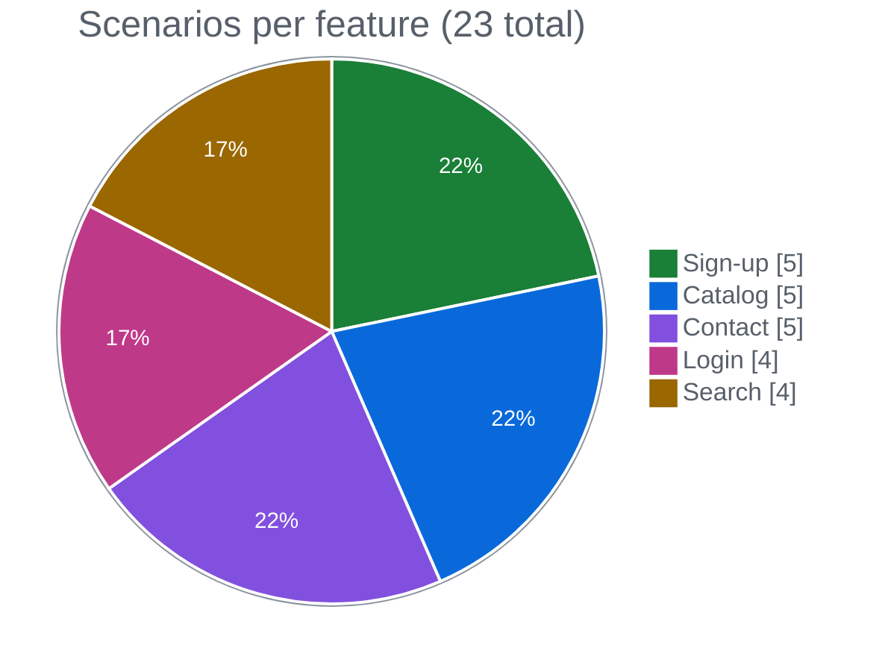

<div align="center">

# 📚 Hub de Leitura · Automação E2E com Cypress

**Automatizei cadastro, login, catálogo, busca e contato de uma plataforma de livros, usando Faker, Fixtures, Comandos Customizados, Page Objects e Cypress Cloud**


🇧🇷 [Português](#-português) · 🇺🇸 [English](#-english)

</div>

---

## 🇧🇷 Português

### 🎯 Objetivo

Esse projeto foi a continuação do [hub-de-leitura-cypress-ui](https://github.com/gustavoanderson/hub-de-leitura-cypress-ui). Comecei com 5 testes de um formulário e ampliei a suíte para cobrir **as 5 jornadas principais** do usuário na plataforma:

| Jornada | O que eu quis garantir |
|---|---|
| 📝 Cadastro | Que um novo leitor consegue criar conta e chegar ao painel |
| 🔐 Login | Que usuário comum e administrador conseguem entrar |
| 📖 Catálogo | Que o botão "Adicionar à cesta" funciona e atualiza o contador |
| 🔎 Busca | Que cada livro do acervo é encontrado pelo título |
| ✉️ Contato | Que o formulário envia e bloqueia campos obrigatórios vazios |

Além de ampliar a cobertura, apliquei as técnicas que deixam uma suíte sustentável: dados dinâmicos, reaproveitamento de código e relatórios centralizados.

### 🧭 Estratégia

#### O mesmo cenário em quatro níveis de maturidade

Implementei o teste de cadastro **quatro vezes, de propósito**, para mostrar a evolução de um teste com dados fixos até um padrão profissional:



| Nível | Técnica | O que ganhei |
|:-:|---|---|
| 1 | E-mail único com `Date.now()` | Nenhum conflito de "e-mail já cadastrado" entre execuções |
| 2 | `@faker-js/faker` | Nomes e e-mails realistas, diferentes a cada execução |
| 3 | `Cypress.Commands.add` | Uma linha no lugar de 7 comandos repetidos |
| 4 | Page Object (`CadastroPage`) | Seletores centralizados: se a tela mudar, ajusto um arquivo só |

#### Dados fora do código

Na busca do catálogo, os livros vêm do arquivo `livros.json` e **valido todos os títulos da lista em um único teste**. Para incluir um livro novo, basta acrescentar uma linha no JSON.



### 🧪 Cobertura



| Funcionalidade | Spec | Cenários | Destaques |
|---|---|:-:|---|
| Cadastro | `cadastro.cy.js` | 5 | Faker, comando customizado, Page Object e validação de nome vazio |
| Catálogo | `catalogo.cy.js` | 5 | Seleção por posição (`first`, `last`, `eq`) e contador da cesta |
| Contato | `contato.cy.js` | 5 | 1 caminho feliz e 4 validações de campo obrigatório |
| Login | `login.cy.js` | 4 | Perfis **usuário** e **admin**, fixture, senha oculta no log e screenshot após cada teste |
| Busca | `catalogo-busca.cy.js` | 4 | Busca direta, massa de dados importada, fixture e validação da lista completa |

### 🧰 Técnicas que apliquei

| Técnica | Onde |
|---|---|
| Hooks (`beforeEach` / `afterEach`) | Todas as specs |
| Massa de dados com Faker | Cadastro |
| Fixtures JSON | Login e Busca |
| Comandos customizados | `cy.login()` e `cy.preencherCadastro()` |
| Page Objects | `CadastroPage` |
| Testes negativos | Cadastro e Contato |
| Senha fora do log | `cy.login()` com `log: false` |
| Evidências em vídeo | 5 vídeos, um por spec |
| Relatórios no Cypress Cloud | Script `cy:report` |

### 📈 Resultados

- **Automatizei 5 jornadas críticas**, do primeiro acesso (cadastro) até a interação com o acervo (busca e cesta).
- **Gravei as execuções.** A pasta [`cypress/videos`](./cypress/videos) tem o vídeo de cada spec, então dá para ver os testes rodando sem instalar nada.
- **Centralizei os relatórios no Cypress Cloud**, com histórico de execuções, vídeos e falhas num painel compartilhável.
- **Deixei a suíte pronta para crescer.** Com Page Object e comandos customizados, cada teste novo de cadastro ou login sai com poucas linhas.
- **Evitei colisão de dados.** Faker e `Date.now()` geram usuários únicos, e a suíte roda quantas vezes for preciso no mesmo ambiente.

### 🚀 Onde esse trabalho se aplica

- **Smoke test de release:** as 5 jornadas formam um check rápido antes de cada deploy.
- **Cobertura que acompanha o acervo:** com a busca orientada a dados, validar dezenas de títulos é só alimentar o JSON.
- **Visibilidade para o time todo:** vídeos e dashboard permitem que PO, suporte e gestão acompanhem a qualidade sem abrir código.
- **Controle de acesso:** o login com dois perfis é a base para testar permissões, um dos bugs mais caros em produção.

### ▶️ Como executar

**Pré-requisitos:** Node.js e a aplicação Hub de Leitura rodando em `http://localhost:3000`.

```bash
npm install
npx cypress open   # modo interativo
npm test           # modo headless no Chrome
```

### 📁 Estrutura

```
cypress-lists/
├── cypress/
│   ├── e2e/
│   │   ├── cadastro.cy.js        # Faker, comando customizado, Page Object
│   │   ├── catalogo-busca.cy.js  # busca orientada a dados
│   │   ├── catalogo.cy.js        # cesta de livros
│   │   ├── contato.cy.js         # formulário de contato
│   │   └── login.cy.js           # usuário e admin
│   ├── fixtures/
│   │   ├── livros.json
│   │   └── usuario.json
│   ├── support/
│   │   ├── commands.js           # cy.login() · cy.preencherCadastro()
│   │   └── pages/cadastro-page.js
│   └── videos/                   # evidências de execução
└── cypress.config.js
```

---

## 🇺🇸 English

### 🎯 Goal

This project continued [hub-de-leitura-cypress-ui](https://github.com/gustavoanderson/hub-de-leitura-cypress-ui). I started with 5 tests for one form and expanded the suite to cover **the 5 main user journeys** on the platform:

| Journey | What I wanted to ensure |
|---|---|
| 📝 Sign-up | A new reader can create an account and reach the dashboard |
| 🔐 Login | Both regular users and admins can log in |
| 📖 Catalog | "Add to basket" works and updates the counter |
| 🔎 Search | Every book in the collection can be found by title |
| ✉️ Contact | The form submits and blocks empty required fields |

### 🧭 Strategy

#### One scenario, four maturity levels

I **deliberately implemented the sign-up test four times** to show the evolution from fixed data to a professional pattern:



| Level | Technique | What I gained |
|:-:|---|---|
| 1 | Unique email via `Date.now()` | No "email already registered" conflicts between runs |
| 2 | `@faker-js/faker` | Realistic names and emails, different on every run |
| 3 | `Cypress.Commands.add` | One line instead of 7 repeated commands |
| 4 | Page Object (`CadastroPage`) | Centralized selectors: if the screen changes, I update one file |

In catalog search, books come from `livros.json` and **I validate every title in a single test**. Adding a book only takes a new line in the JSON.

### 🧪 Coverage



### 📈 Results

- **I automated 5 critical journeys**, from sign-up to browsing the collection.
- **I recorded every run.** [`cypress/videos`](./cypress/videos) holds a video of each spec.
- **I centralized reporting in Cypress Cloud**, with run history, videos and failures in a shareable dashboard.
- **I built the suite to grow.** With Page Objects and custom commands, each new test takes only a few lines.
- **I avoided data collisions.** Faker and `Date.now()` generate unique users, so the suite can run repeatedly in the same environment.

### 🚀 Where this applies

- **Release smoke test:** the 5 journeys form a quick check before each deploy.
- **Coverage that grows with the catalog:** validating dozens of titles only takes feeding the JSON.
- **Visibility for the whole team:** videos and the dashboard let POs, support and managers follow quality without reading code.
- **Access control:** the two-profile login is the base for permission testing.

### ▶️ How to run

```bash
npm install
npx cypress open   # interactive
npm test           # headless (Chrome)
```

---

<div align="center">

Feito por **Gustavo Anderson** · QA Engineer
[](https://www.linkedin.com/in/gustavo-anderson)
[](https://github.com/gustavoanderson)

</div>
